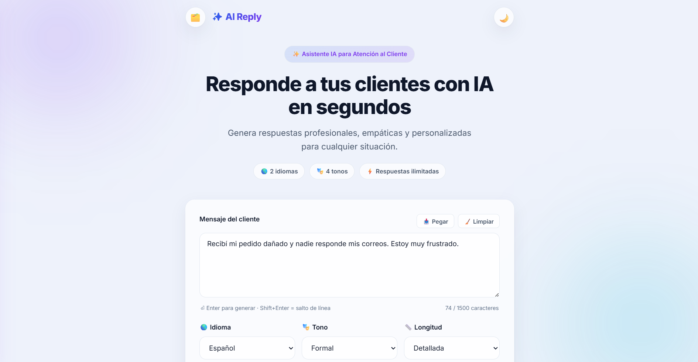
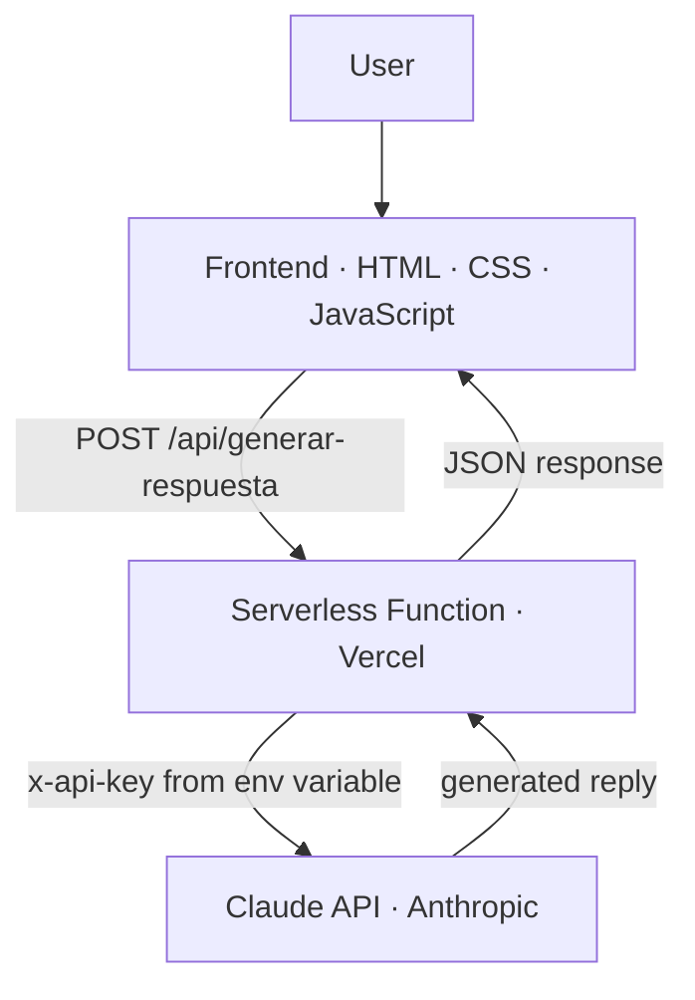
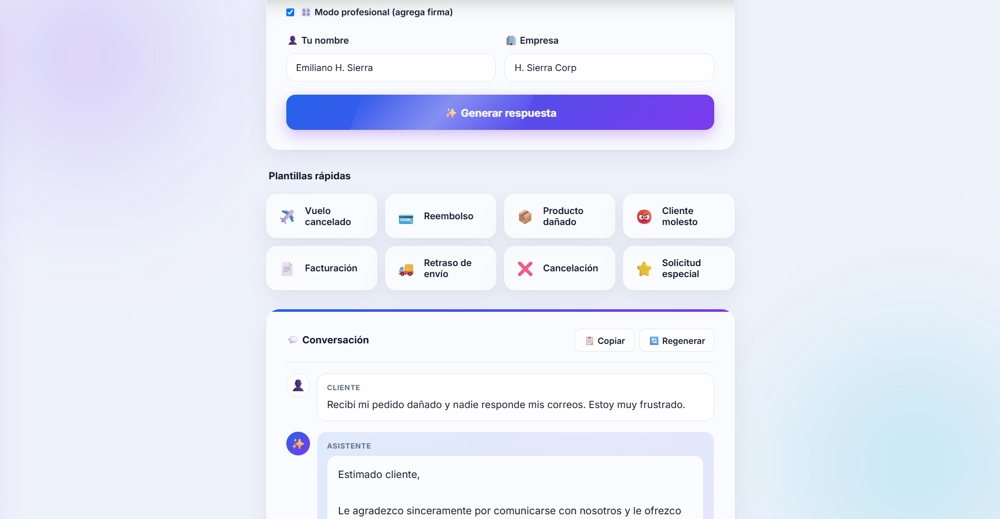
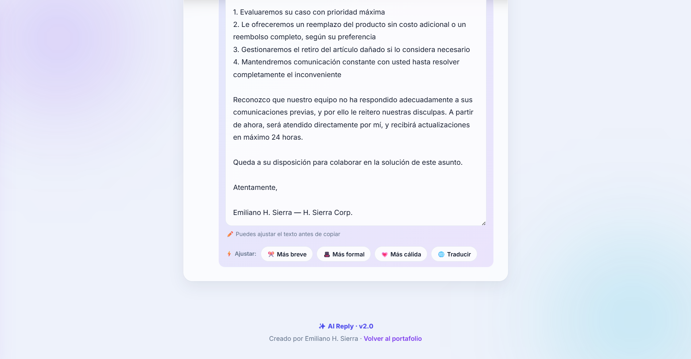
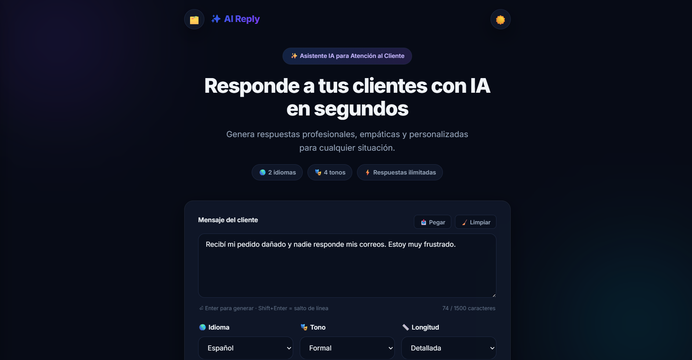
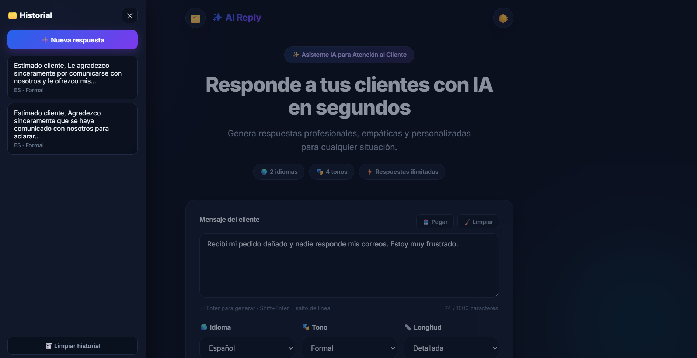

<h1 align="center">AI Customer Support Assistant</h1>

<p align="center">
  A production web app that drafts professional, bilingual customer-support replies —<br/>
  powered by the Claude API and a secure serverless architecture.
</p>

<p align="center">
  
  
  
  
  
  
</p>

<p align="center">
  
</p>

<p align="center">
  <a href="https://asistente-virtual-livid.vercel.app"><b>Live Demo →</b></a>
</p>

---

## Overview

Support teams spend hours drafting repetitive, on-brand replies across multiple languages. This app turns a customer's message into a professional, ready-to-send reply in seconds — with full control over tone, language, and length — while keeping API credentials secure on the server.

---

## Features

### AI
- Claude API response generation
- Prompt engineering for tone and format control
- Bilingual output (Spanish / English)

### User Experience
- Responsive design
- Dark mode
- Editable replies
- Chat-style conversation view

### Productivity
- Conversation history
- Quick actions — shorten, formalize, translate
- Professional mode with automatic signature

---

## Architecture

The API key is stored server-side and is never exposed to the browser.



---

## Technologies

| Technology | Purpose |
|------------|---------|
| JavaScript | Application logic and DOM |
| HTML5 / CSS3 | Interface and styling |
| Claude API | AI response generation |
| Serverless Functions | Secure backend |
| Vercel | Hosting and continuous deployment |
| Git and GitHub | Version control |

---

## How It Works

1. The user pastes a customer message and selects tone, language, and length.
2. The frontend calls an internal serverless endpoint (`/api/generar-respuesta`).
3. The function attaches the secret API key from an environment variable and calls the Claude API.
4. The generated reply returns to the interface, where it can be edited, refined, or translated.

---

## Installation

```bash
git clone https://github.com/emilianohsierra/Asistente-Virtual.git
cd Asistente-Virtual/asistente-soporte
```

The frontend is static; the backend runs as a Vercel serverless function.

---

## Configuration

Deploy on [Vercel](https://vercel.com):

1. Import the repository.
2. Set the **Root Directory** to `asistente-soporte`.
3. Add the environment variable listed below.
4. Deploy.

### Environment Variables

| Variable | Description |
|----------|-------------|
| `ANTHROPIC_API_KEY` | Anthropic API key, read server-side only |

---

## Roadmap

- [ ] Custom domain
- [ ] Saved reply templates
- [ ] Multi-provider LLM support
- [ ] Usage analytics

---

## Screenshots

<table>
  <tr>
    <td width="50%"></td>
    <td width="50%"></td>
  </tr>
  <tr>
    <td width="50%"></td>
    <td width="50%"></td>
  </tr>
</table>

---

## Author

**Emiliano Lizarraga** — AI-Assisted Developer
Portfolio: https://emilianohsierra.vercel.app · GitHub: https://github.com/emilianohsierra

---

## License

Released under the MIT License. See [`LICENSE`](LICENSE) for details.
