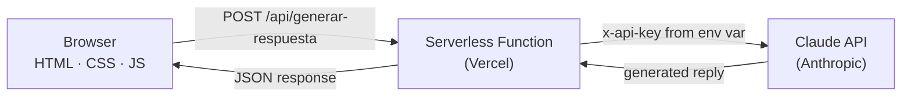

# 🤖 AI Customer Support Assistant

> Full-stack web app that generates professional, **bilingual (ES / EN)** customer-support replies using AI (Claude).

**🔗 Live demo:** https://asistente-virtual-livid.vercel.app

---

## 💡 The problem it solves
Customer-support teams spend hours writing repetitive, on-brand replies — often in more than one language. This app turns a customer's message into a **professional, ready-to-send reply in seconds**, with full control over tone, language, and length.

## ✨ Features
- 🤖 AI-generated support replies (Claude API)
- 🌎 Bilingual output (Spanish / English)
- 🎭 Tone, language and length controls
- ✏️ Editable reply before copying
- ⚡ Quick actions: shorter · more formal · warmer · translate
- 🎛️ Professional mode (adds a signature with your name + company)
- 🗂️ Sidebar history (saved locally) + 💬 chat-style conversation view
- 🌙 Dark mode · 📱 fully responsive

## 🏗️ Architecture
The API key lives **only on the server** (Vercel environment variable) — it is never exposed to the browser.

## 🛠️ Tech stack
| Layer | Technology |
|-------|-----------|
| Frontend | HTML, CSS, JavaScript (vanilla) |
| Backend | Vercel Serverless Functions (Node.js) |
| AI | Claude API (Anthropic) |
| Hosting / CI-CD | Vercel (GitHub push-to-deploy) |

## 🔒 Security
- `ANTHROPIC_API_KEY` is stored as a Vercel environment variable and read **only on the server**.
- The frontend never sees the key — it calls our own `/api/generar-respuesta` endpoint.

## 🚀 Run it yourself
1. Fork this repo and import it into [Vercel](https://vercel.com).
2. Set the **Root Directory** to `asistente-soporte`.
3. Add an environment variable `ANTHROPIC_API_KEY` with your Anthropic API key.
4. Deploy 🚀

## 👤 Author
**Emiliano Lizarraga** — AI-Assisted Developer
🌐 [Portfolio](https://emilianohsierra.vercel.app) · 💻 [GitHub](https://github.com/emilianohsierra)
